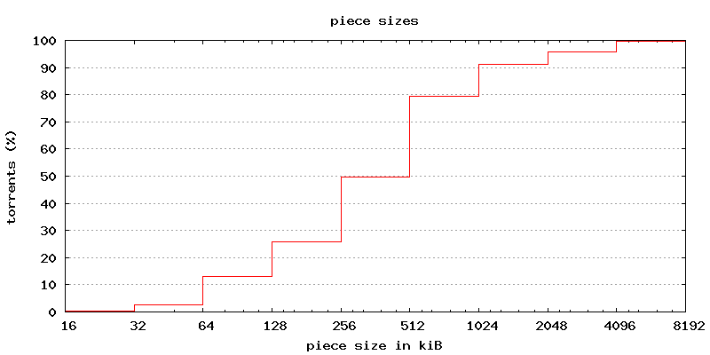
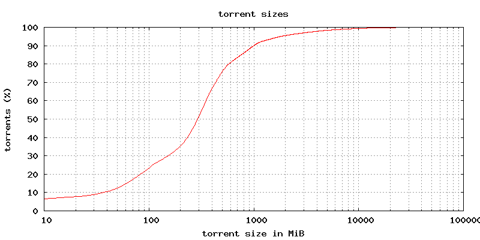
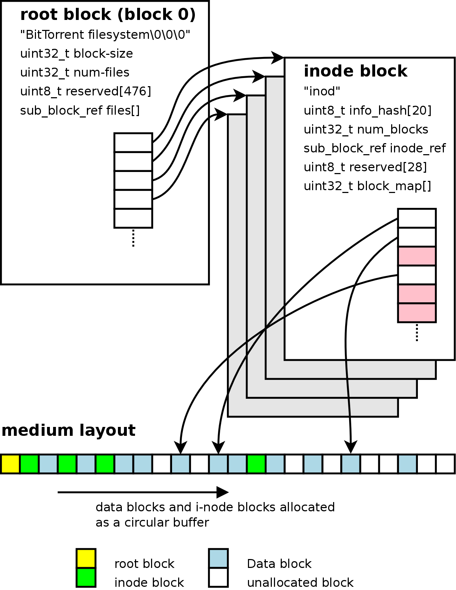
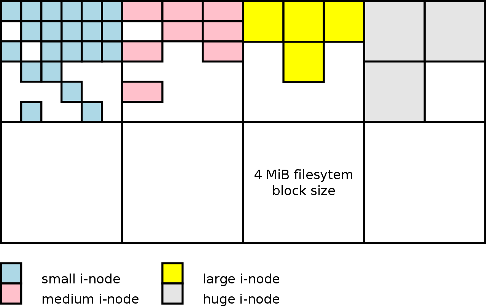
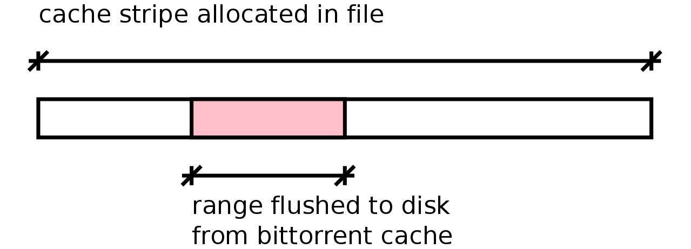
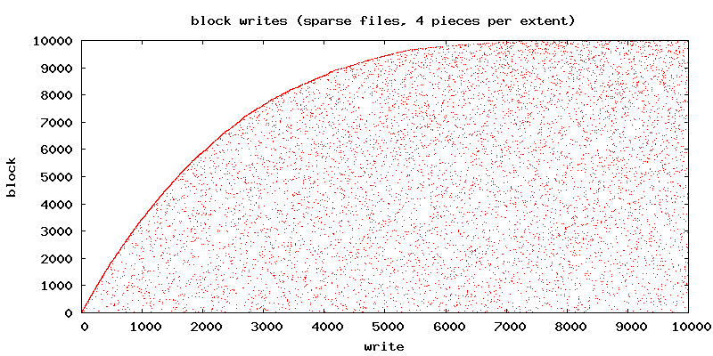
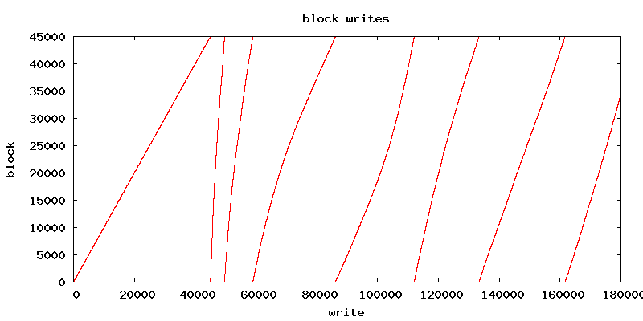
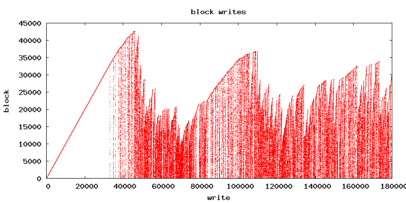
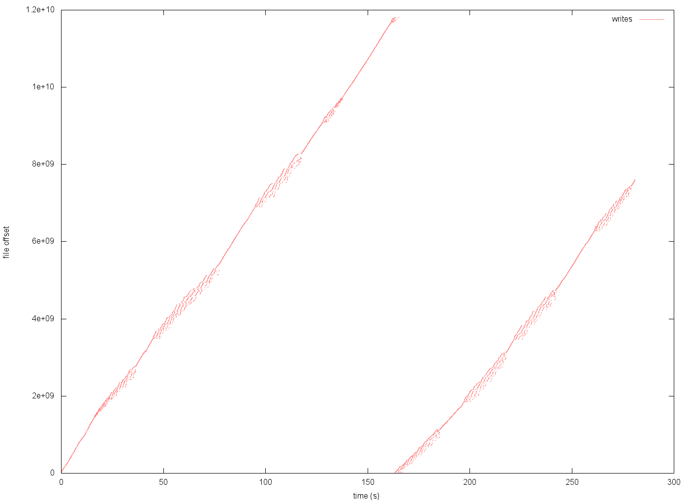

================================================================
DRAFT: Improving BitTorrent performance with a custom filesystem
================================================================

:author: Arvid Norberg, arvid@rasterbar.com
:date: August 2012
:abstract: One of the main bottlenecks when downloading and seeding
	content over bittorrent is accessing the disk. This paper explores
	the option to bypass traditional filesystems and use a block device
	as storage for torrents, in order to improve download performance

.. raw:: pdf

	PageBreak twoColumn
	SetPageCounter 1

.. header::

	.. class:: center

		###Page###

.. section-numbering::

background
----------

BitTorrent downloads conceptually divide up content into *pieces*,
which are downloaded in *rarest-first* order.

The size of a piece is determined by the creator of a torrent, but
is typically a power of 2 in the range 16 kiB - 4 MiB.

The availability of pieces is kept as part of the downloader state,
that is, the number of peers that have each piece. This availability
is used to prefer downloading pieces that are (locally) rare. Among
pieces with equal availability, pieces are downloaded at random.

From the disk's point of view, pieces are written in random order,
as well as read in random order (when other peers requests pieces).

disk access characteristics
...........................

The typical mode of disk access for bittorrent is random access at
piece-level and essentially sequential access within pieces. The size
of pieces varies with each torrent. However, typical piece sizes
are 4 MiB or smaller.

In a sample of about 700k torrents yield the following cumulative piece
size distribution::

     16 kiB:  0.4 %
     32 kiB:  2.6 %
     64 kiB: 13.1 %
    128 kiB: 25.8 %
    256 kiB: 49.7 %
    512 kiB: 79.4 %
   1024 kiB: 91.3 %
   2048 kiB: 95.9 %
   4096 kiB: 99.7 %
   8192 kiB: 99.8 %
  16384 kiB: 100.0 %

	piece size distribution

A reasonable upper limit of an expected piece size in the wild is
clearly 4 MiB.

Both downloading and uploading with bittorrent causes random disk
access at the piece level. For this reason, there is no advantage
for bittorrent to keep files contiguous on disk; reading will be
just as random access anyway.

block alignment
...............

Dealing with *multi-file torrents*, torrents that download to multiple
files rather than a single one, chances are that a significant number
of blocks on disk are not aligned with pieces.

For example, if a torrent contains one small text file as the first
file, and then a multi gigabyte video file, all blocks in the video
file are shifted and the bittorrent pieces won't line up with the blocks
on disk. That is unless the text file is exactly divisible by 512 bytes
(the typical block size of hard drives). Writing unaligned blocks to disk
is not optimal, since the operating system or filesystem cache need to
read the edge blocks from disk, in order to overlay the beginning and
the end of the block. Typically the whole memory buffer would have to
be copied into an aligned buffer as well, before the driver can DMA it
over to the disk.

There are a few solutions to this problem. The simplest one is to craft
torrent files in such way that the majority of pieces are aligned with
disk blocks. This can be done either by moving the largest file to the
front of the file list, and also by inserting dummy pad-files in between,
to make large files start on a block or piece boundary.

The client downloading or seeding the torrent can also simply store all
files concatenated together in a single large file on disk.

torrent size
............

Looking at the torrent size distribution on the same sample of torrents:

A few observations from this data is half of all torrents are smaller
than 300 MiB. 98.36 % of all torrents are smaller than 5 GiB.

	torrent size CDF

The maximum torrent size in the sample set is 730.6 GiB. One of the largest torrents
spotted in the wild was 746.70 GiB [#tf_records]_.

.. [#tf_records] http://torrentfreak.com/5-torrent-files-that-broke-mind-boggling-records-101107/

.. raw: pdf

		FrameBreak 50

filesystem 
----------

This section describes the design and rationale for the new filesystem used
to store torrent files.

properties
..........

Based on the characteristics of the disk access of torrent files, a
bittorrent centric filesystem would likely perform well with the following
properties:

* files are always assumed to be fully fragmented in chunks of 4 MiB.
  There is no gain in allocating more than 4 MiB data blocks contiguously,
  since they're read out-of-order anyway.
* instead of splitting multi-file torrents into actual files, treat
  an entire torrent as a single file on disk in order to keep all bittorrent
  pieces aligned to disk blocks.
* torrents of at least 1 PiB must be supported, and probably more than that
  for head room.

overview
........

Hard drives and other storage mediums that filesystems run on typically has a
*block device* abstraction layer in common. This layer makes the raw storage
of a device available as an array of blocks. A block being the minimum transfer
unit to and from the device. The block size for typical drives is 512 Bytes.

On top of the block device, filesystems typically impose their own, larger,
block size. The filesystem block size must be a multiple of the device block
size and ends up being in the order of a few kilobytes.

Locations on the disk is typically addressed by the filesystem block number.

When the filesystem needs to find a filesystem block to store data in, it uses
a block allocator. The block allocator is a bitfield and a cursor to the last
allocated block. To allocate a block, the bitfield is scanned forward, from
the cursor, until a free block is found.

When a block is freed, its bit is simply cleared in the bitfield.

The same allocation strategy is used for data blocks as metadata blocks.
This makes the metadata scattered across the whole disk.

Filesystem metadata is the supporting structure around the user data, to
associate it with the correct file and location. Filesystem metadata is
described in more detail below.

	Overview of filesystem structure.

root block
..........

The root block of the filesystem is the entry point of everything stored on
the disk. Therefore, the root block is stored in a well defined location,
which is block 0. That is, the first 4 MiB of the device is occupied by
the root of the filesystem.

Contrary to typical filesystems, there is no need for a directory structure.
Since the filesystem only stores torrents, they already have an identifier
guaranteed to be unique, their info-hash.

The main portion of the root block therefore contains a flat list of all files
stored in the filesystem. Apart from that, it contains an identifying header,
to be able to verify that the drive actually contains the expected filesystem,
and the filesystem block size. The block size would normally be 4 MiB, but
could be other powers of 2.

The file list is not ordered in any way on disk, it is expected to be
organized in an efficient data structure in memory. This implementation
stores files in-memory in a hash table, with the info-hash as the key.

block map
.........

Typical filesystems maps file blocks to filesystem blocks by arrays of *extents*,
or block runs. An extent is essentially a start and an end block reference. This
approach makes sense when block sizes are small and there is an affinity to
keep files as contiguous as possible (i.e. less fragmented).

Files are expected to be fully fragmented at 4 MiB boundaries (because of the
random access nature of BitTorrent), which makes a simple block map more space
efficient than extents. The first entry maps the first 4 MiB of the file to the
filesystem block number holding that data, and so on.

Files are also expected to be sparse. That means block entries must be able to
indicate that the block has not been allocated on disk yet.

Each entry in the block map is 4 bytes. The size of the block map determines
the maximum size of the file it can hold. A map for a 1 GiB file requires
1024 Bytes worth of block map (with a 4 MiB block size). A map for a 1 PiB
file requires 1 MiB worth of block map.

i-nodes
.......

Information nodes, commonly called *i-nodes*, are a filesystem's file
entries. The i-nodes in this filesystem can be very simple. It essentially
just contains:

* an i-node identifier (for consistency checking).
* the info-hash of the torrent it holds.
* a reference to where it is stored on disk (for convenience and consistency
  checking).
* a block map, mapping blocks in the file address space to blocks in the
  filesystem address space.

The i-nodes need to support torrents that are more than 1 PiB in size. Assuming
a 4 MiB filesystem block size, the block map needs to fit 268,435,456 block
mappings. A mapping is simply a ``uint32_t`` referring to the filesystem block
at that index. Since each slot is 4 bytes, that means the i-node would have to
be 1 MiB.

Since most torrents are 4.5 GiB or smaller, it would be wasteful to allocate a
full Megabyte for every i-node. Apart from wasting disk, storing i-node
headers 1 MiB apart on disk makes reading them all less efficient, since the
read head needs to move farther and spend less time reading.

The typical solution to this problem in proper filesystems is to have indirect
blocks. That is, the i-node has an extra block reference to another filesystem
block, which only contains a block map.

For the purpose of this filesystem, that solution has two drawbacks.

1. It complicates the layout on disk.
2. It makes it more expensive to read the block-map, since it would
   be disconnected from the i-node block.

For these reasons, it seems like a good idea to allow i-nodes to have different
sizes.

The i-nodes are allocated using a slab allocator, with 13 slabs. The sizes are
1 kiB, 2 kiB, 4 kiB, 8 kiB, 16 kiB, 32 kiB, 64 kiB, 128 kiB, 256 kiB, 512 kiB,
1 MiB, 2 MiB and 4 MiB.

Each slab, in turn, allocates normal filesystem blocks used as storage for the
i-nodes. The free list in each slab is kept sorted, in order to create a strong
bias towards earlier slots, and concentrate allocations into as few filesystem
blocks as possible. Whenever the last i-node is freed from a filesystem block,
it is returned to the global block free-list.

This setup supports efficient storage of regular torrents, the common case, as
well as supporting the rare case of a very large torrent, several PiB in size.

	Allocation of i-nodes of varying sizes on top of
	the filesystem block partitioning.

booting
.......

There is no bitmap describing which blocks are free, instead the free
block list is built at boot-time. This is possible because of the lack
of directory structure and i-nodes being well packed at the beginning
of the device.

To build the free-list of filesystem blocks, the filesystem:

1. reads the root block (block 0) and mark it as in-use.
2. collects all i-node references.
3. sorts the i-node references in ascending order.
4. reads all the i-node blocks, marking off themselves
   and all the blocks in the block map, as in-use.

At boot time, the root block is also turned into a more efficient in-memory
representation. All i-nodes are put in a hash table with their info-hash
(file name) as the key. All i-nodes are kept in memory as well.

journaling
..........

Journaling is the technique where data on disk is guaranteed to be
in a consistent state at any given time. It removes the requirement
to run tools like checkdisk if the computer is turned off by a power
outage or the whole system crashes.

Journaling typically only applies to the filesystem structure itself.
The content of files does not have the consistency guarantee, which
probably is fine for the most part.

Journals can be implemented by simply (when flushing filesystem metadata
updates) first flush all the updated blocks into the journal, then start
updating the actual blocks. Flushing to the journal is often fast because
it is a contiguous chunk of the disk. If the system crashes at any time
during the metadata update, the filesystem can simply pick up the changes
from the journal and replay them to get into a consistent state.

The reason why a filesystem would need to do this is because the metadata
updates are mutually dependent on each other. If each individual block
of metadata that was updated was entirely self-contained, and would not
cause any incinsistencies at any given point (assuming writing one
block is atomic), there would be no need for a journal.

The bittorrent filesystem is so simple, making sure the filesystem
is consistent at all times, is just a matter of making sure blocks are
flushed in the right order.

For any of the consistency guarantees to hold, the filesystem must
operate on a raw defice with no buffering.

disk usage optimization
.......................

With a filesystem block size of 4 MiB, most torrents will run at a fairly large amount
of wasted disk space. For torrents with piece sizes less than 4 MiB, each downloaded
piece will still allocate 4 MiB on disk, and waste the remaining space until the
adjacent pieces are downloaded.

In order to reduce wasted space, and improve locality of disk writes, an affinity
for downloading the adjacent pieces is created. The adjacent pieces are picked such
that they all fall into the same 4 MiB filesystem block.

The advantage, apart from more efficiently utilizing the disk space, is that while
filling up the disk, writes may tend to happen physically closer to each other.

This is a crucial optimization. There is a steep performance gain in going from
being almost sequential, to actually be sequential. For this reason, libtorrent
was made to force cache any adjacent pieces of 4 MiB, until the whole 4 MiB is
downloaded, before flushing it. This way, all flushes are always (or at least
essentially always) 4 MiB at a time, aligned with the filesystem blocks.

zero-fill
.........

When typical filesystems allocate blocks for a file, they sometimes
have to be filled with zeros, in order to not leak potentially sensitive
information that may have been stored in that block previously. This is presumably
mostly the case when perorming small writes, that don't completely fill a block.
This case is fairly common for multi file torrents, for the pieces that are
not aligned with filesystem blocks.

This is another opportunity for optimizations. Filling reused blocks with zeros
is not strictly necessary, since the bittorrent layer restricts access to any
portions of the file that has not been written.

metadata updates
................

Typical filesystems, such as ext4, supports *access timestamps*. These are time-
stamps updated every time a file is accessed, for instance read from. These updates
to file metadata can potentially be costly. For this reason, Linux has introduced
a ``O_NOATIME`` flag which opens a file in a mode that doesn't update the file's
access time. This has the restriction that it only works if the process opening
the file runs as the same user as the owner of the file.

With a custom filesystem almost no metadata needs to be kept per file, and more
importantly, almost no metadata needs to be kept up to date on disk. This is a
potential performance improvement.

extents
.......

It turns out that a significant performance gain comes from aligning pieces,
and ranges of pieces, to be downloaded and flushed to disk with the filesystem's
default extent allocation size and alignment.

	When writing a small piece to a filesystem with large default extents,
	the extent is not fully filled-in by a write. Causing the drive to seek
	back later when those parts of the file are downloaded.

In the case where the bittorrent cache's stripe size is not aligned with the file-
system's the allocation strategy is not optimal. Assuming a random uniform
distribution of the download order of pieces, early pieces are more likely
to allocate a new extent in the file, which is fast because it is done sequentially
from the current disk head position. However, later pieces are more likely to have to
seek back into the previously allocated extents to fill them in.

	Write pattern when filling a sparse file at random (where the extents
	by which the file grows fit 4 blocks).

By aligning the cache stripes, the bittorrent engine will attempt to download
ranges of pieces that fill an entire extent allocation. This results in allocating
a new extent in the file and also completely fills it with data. There will not be any
need to seek back to fill in any other pieces. This yields near sequential write
performance.

block allocation
................

Two different block allocation strategies were tested.

sequential block allocator
	Treats the disk as a ring buffer, allocating the next free block and
	wrap back to 0.

ordered block allocator
	allocates the lowest indexed free block for data and the highest
	indexed free block for i-nodes.

Comparing the two with identical, artificial, payloads yields the following access
graphs:

	disk access pattern for sequential block allocator (writes)

	disk access pattern for ordered block allocator (writes)

Rotating disks perform significantly better under the sequential allocation scheme.

benchmarks
----------

The benchmark was run on a Mac with the following specifications::

	hw.machine = x86_64
	hw.model = MacPro4,1
	hw.ncpu = 16
	hw.physmem = 2147483648
	hw.pagesize = 4096
	hw.busfrequency = 4294967295
	hw.cpufrequency = 2260000000

Downloading 25 torrents, 1 GB each, 10 torrents in parallel, 1 GB cache:

btfs file on top of hfs+: 281 seconds (avg: 91.10 MB/s)
directly to hfs+: 897 seconds (avg: 28.54 MB/s)

	Write pattern when on the block device level in the btfs benchmark.

The conclusion is that BitTorrent downloads whose download rate is limited
by spinning disks, could potentially be made 3 times faster with a custom
file system where writes are made more sequential, block aligned and has
less metadata overhead.

